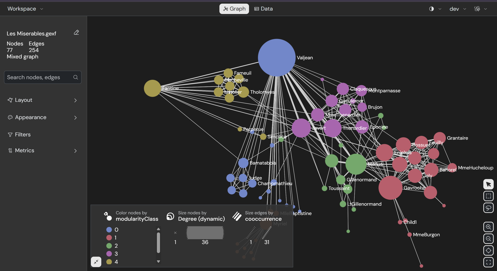

# NQL — Nietzsche Query Language

## Manual de Referencia Completo

**Versao:** 2.0 (NQL v2 — Fases 1-11 implementadas)
**Banco:** NietzscheDB — Temporal Hyperbolic Graph Database
**Parser:** pest (PEG Grammar) em Rust
**Repositorio:** github.com/JoseRFJuniorLLMs/NietzscheDB

---

> *NQL e a primeira linguagem de query com primitivas hiperbolicas nativas
> e funcoes matematicas eponymous — nomeadas em homenagem aos matematicos
> cujo trabalho fundamenta o NietzscheDB.
> Nao e uma extensao de Cypher, SQL ou SPARQL. E uma linguagem nova,
> construida para um substrato de memoria que nao existia antes.*

---

## Indice

1. [Conceitos Fundamentais](#1-conceitos-fundamentais)
2. [Tipos de Dados](#2-tipos-de-dados)
3. [Statements](#3-statements)
   * [MATCH](#31-match)
   * [DIFFUSE](#32-diffuse)
   * [RECONSTRUCT](#33-reconstruct-fase-11)
   * [EXPLAIN](#34-explain)
4. [Operadores de Distancia](#4-operadores-de-distancia)
   * [HYPERBOLIC\_DIST](#41-hyperbolic_dist)
   * [SENSORY\_DIST](#42-sensory_dist-fase-11)
5. [Funcoes Matematicas Eponymous](#5-funcoes-matematicas-eponymous)
   * [POINCARE\_DIST](#51-poincare_dist--henri-poincare)
   * [KLEIN\_DIST](#52-klein_dist--felix-klein)
   * [MINKOWSKI\_NORM](#53-minkowski_norm--hermann-minkowski)
   * [LOBACHEVSKY\_ANGLE](#54-lobachevsky_angle--nikolai-lobachevsky)
   * [RIEMANN\_CURVATURE](#55-riemann_curvature--bernhard-riemann)
   * [GAUSS\_KERNEL](#56-gauss_kernel--carl-friedrich-gauss)
   * [CHEBYSHEV\_COEFF](#57-chebyshev_coeff--pafnuty-chebyshev)
   * [RAMANUJAN\_EXPANSION](#58-ramanujan_expansion--srinivasa-ramanujan)
   * [HAUSDORFF\_DIM](#59-hausdorff_dim--felix-hausdorff)
   * [EULER\_CHAR](#510-euler_char--leonhard-euler)
   * [LAPLACIAN\_SCORE](#511-laplacian_score--pierre-simon-laplace)
   * [FOURIER\_COEFF](#512-fourier_coeff--joseph-fourier)
   * [DIRICHLET\_ENERGY](#513-dirichlet_energy--peter-gustav-lejeune-dirichlet)
6. [Clausulas e Operadores](#6-clausulas-e-operadores)
   * [WHERE](#61-where)
   * [ORDER BY](#62-order-by)
   * [LIMIT / SKIP](#63-limit--skip)
   * [RETURN](#64-return)
   * [DISTINCT](#65-distinct)
   * [AS (alias)](#66-as-alias)
   * [IN](#67-in)
   * [BETWEEN](#68-between)
   * [CONTAINS / STARTS\_WITH / ENDS\_WITH](#69-contains--starts_with--ends_with)
   * [AND / OR / NOT](#610-and--or--not)
7. [Agregacoes](#7-agregacoes)
   * [COUNT / SUM / AVG / MIN / MAX](#71-count--sum--avg--min--max)
   * [GROUP BY](#72-group-by)
8. [Planner — Como NQL decide a estrategia](#8-planner)
9. [Parametros e Variaveis](#9-parametros-e-variaveis)
10. [Comparacao com outras linguagens](#10-comparacao-com-outras-linguagens)
11. [Exemplos por dominio](#11-exemplos-por-dominio)
12. [Erros e diagnostico](#12-erros-e-diagnostico)
13. [Referencia rapida](#13-referencia-rapida)

---

## 1. Conceitos Fundamentais

### O espaco onde NQL opera

NQL nao opera em tabelas, nem em documentos, nem em grafos euclidianos.
Opera na **Bola de Poincare** — um espaco hiperbolico onde:

```
Centro da bola  ->  conceitos abstratos, categorias gerais
Fronteira       ->  instancias especificas, memorias episodicas

Regra invariante: ||x|| < 1.0 para todo embedding
```

Toda distancia calculada pelo NQL e **distancia hiperbolica**:

```
d(u,v) = arcosh(1 + 2||u-v||^2 / ((1-||u||^2)(1-||v||^2)))
```

Isso significa que a mesma query retorna resultados diferentes de um banco euclidiano — ela entende hierarquia geometricamente, nao por metadados.

### Os tres objetos fundamentais

**No (Node):**
A unidade basica de memoria. Contem um embedding hiperbolico, metadados JSON, energia, profundidade, dimensao de Hausdorff local e opcionalmente um payload sensorial (Fase 11).

**Aresta (Edge):**
Relacao tipada entre dois nos. Tipos: `Association`, `Hierarchical`, `LSystemGenerated`, `Pruned`.

**Grafo:**
O conjunto vivo de nos e arestas. Nao e estatico — cresce via L-System, e podado via Hausdorff e se reconsolida via ciclo de sono.

### A energia dos nos

Todo no tem `energy in [0.0, 1.0]`:

```
1.0  ->  no recem-criado, maxima vitalidade
0.7  ->  no ativo, regularmente acessado
0.5  ->  no em decaimento, menos relevante
0.3  ->  no esquecendo — payload sensorial degradado
0.1  ->  apenas o embedding sobrevive
0.0  ->  poda — no removido do grafo
```

### Propriedades acessiveis dos nos

| Campo               | Tipo   | Descricao                                  |
| ------------------- | ------ | ------------------------------------------ |
| `n.id`              | String | UUID do no                                 |
| `n.energy`          | Float  | Energia atual (0.0-1.0)                    |
| `n.depth`           | Float  | Profundidade hiperbolica                   |
| `n.hausdorff_local` | Float  | Dimensao de Hausdorff local                |
| `n.lsystem_generation` | Float | Geracao L-System                        |
| `n.created_at`      | Float  | Timestamp de criacao                       |
| `n.node_type`       | String | Tipo do no (Memory, Concept, etc.)         |

---

## 2. Tipos de Dados

### Primitivos

| Tipo     | Descricao                        | Exemplo               |
| -------- | -------------------------------- | --------------------- |
| `Float`  | Numero de ponto flutuante 64-bit | `0.75`                |
| `Int`    | Inteiro 64-bit                   | `10`                  |
| `String` | Texto UTF-8 entre aspas         | `"memoria clinica"`   |
| `Bool`   | Booleano                         | `true`/`false`        |
| `Uuid`   | Identificador unico              | `"abc123-..."`        |
| `Vector` | Array de floats `[f1, f2, ...]`  | `[0.1, 0.2, 0.3]`    |

### Tipos compostos

**PoincareVector:** vetor com invariante `||x|| < 1.0` garantida.

**Modality (Fase 11):**

```
Image | Audio | Text | Fused
```

### Parametros

Variaveis externas prefixadas com `$`:

```nql
$query_vec     -- vetor de embedding (PoincareVector)
$node_id       -- UUID de um no especifico
$threshold     -- valor numerico passado pelo cliente
$text          -- string passada pelo cliente
$t             -- escalar para funcoes parametricas
```

---

## 3. Statements

### 3.1 MATCH

Busca nos no grafo com filtros, ordenacao, agregacao e paginacao.

**Sintaxe completa:**

```nql
MATCH (alias[:Label])
[WHERE condicao]
RETURN [DISTINCT] expressao [AS nome] [, ...]
[GROUP BY campo [, ...]]
[ORDER BY expressao ASC|DESC]
[LIMIT n]
[SKIP n]
```

**Exemplo minimo:**

```nql
MATCH (m:Memory)
WHERE m.energy > 0.0
RETURN m
LIMIT 10
```

**Com filtro hiperbolico:**

```nql
MATCH (m:Memory)
WHERE HYPERBOLIC_DIST(m.embedding, $query_vec) < 0.5
RETURN m
ORDER BY HYPERBOLIC_DIST(m.embedding, $query_vec) ASC
LIMIT 10
```

**Com filtros compostos:**

```nql
MATCH (m:Memory)
WHERE HYPERBOLIC_DIST(m.embedding, $query_vec) < 0.5
  AND m.depth > 0.6
  AND m.energy > 0.3
RETURN m
ORDER BY m.depth DESC
LIMIT 20
```

**Com funcao matematica:**

```nql
MATCH (n)
WHERE POINCARE_DIST(n.embedding, $q) < 0.5
  AND MINKOWSKI_NORM(n.embedding) > 2.0
RETURN n
ORDER BY POINCARE_DIST(n.embedding, $q) ASC
LIMIT 10
```

**Traversal com arestas:**

```nql
MATCH (a)-[:Association]->(b)
WHERE a.energy > 0.5
RETURN b
```

**Aresta anonima:**

```nql
MATCH (a)-->(b)
WHERE a.energy > 0.5
RETURN b
LIMIT 15
```

**Direcao inversa:**

```nql
MATCH (a)<-[:Hierarchical]-(b)
WHERE a.energy > 0.3
RETURN a, b
```

**Com agregacao:**

```nql
MATCH (n:Memory)
WHERE n.energy > 0.0
RETURN n.node_type, COUNT(*) AS total, AVG(n.energy) AS avg_e
GROUP BY n.node_type
```

**Com paginacao:**

```nql
MATCH (n)
WHERE n.energy > 0.3
RETURN n
ORDER BY n.energy DESC
LIMIT 10
SKIP 20
```

**Com DISTINCT:**

```nql
MATCH (n:Memory)
WHERE n.energy > 0.5
RETURN DISTINCT n
LIMIT 50
```

**Com IN:**

```nql
MATCH (n)
WHERE n.energy IN (0.3, 0.5, 0.8)
RETURN n
```

**Com BETWEEN:**

```nql
MATCH (n)
WHERE n.energy BETWEEN 0.3 AND 0.8
RETURN n
```

**Com operadores de string:**

```nql
MATCH (n)
WHERE n.id CONTAINS "abc"
RETURN n

MATCH (n)
WHERE n.node_type STARTS_WITH "Mem"
RETURN n

MATCH (n)
WHERE n.id ENDS_WITH "f00"
RETURN n
```

---

### 3.2 DIFFUSE

Propaga ativacao pelo grafo via **heat kernel hiperbolico**.
Retorna nos ativados em multiplas escalas de difusao.

**Conceito central:**

```
t pequeno  ->  ativa vizinhos proximos (recall especifico)
t grande   ->  ativa nos distantes semanticamente (associacao livre)
```

**Sintaxe completa:**

```nql
DIFFUSE FROM $param | alias
  [WITH t = [t1, t2, ..., tn]]
  [MAX_HOPS n]
  [RETURN expressao [, ...]]
```

**Exemplo basico:**

```nql
DIFFUSE FROM $node_id
  WITH t = [0.1, 1.0, 10.0]
  MAX_HOPS 5
RETURN path
```

**Minimo:**

```nql
DIFFUSE FROM $n
RETURN path
```

**O que cada escala t significa na pratica:**

| t    | Raio aproximado | Uso tipico                             |
| ---- | --------------- | -------------------------------------- |
| 0.1  | 1 hop direto    | Vizinhos imediatos, recall preciso     |
| 0.5  | 1-2 hops        | Contexto proximo                       |
| 1.0  | 2-3 hops        | Contexto ampliado                      |
| 5.0  | 3-5 hops        | Associacoes tematicas                  |
| 10.0 | 5+ hops         | Associacao livre, conexoes distantes   |

---

### 3.3 RECONSTRUCT (Fase 11)

Reconstroi a experiencia sensorial de um no a partir do latent armazenado.

**Sintaxe:**

```nql
RECONSTRUCT $param | alias
  [MODALITY nome]
  [QUALITY nivel]
```

**Exemplos:**

```nql
-- Completo
RECONSTRUCT $session_node_id
  MODALITY audio
  QUALITY high

-- Minimo
RECONSTRUCT $nid

-- So modalidade
RECONSTRUCT $n MODALITY text
```

**Qualidade disponivel depende de energy:**

| energy   | Qualidade maxima disponivel    |
| -------- | ------------------------------ |
| > 0.7    | `high` (f32 latent)            |
| 0.5-0.7  | `medium` (f16)                 |
| 0.3-0.5  | `low` (int8)                   |
| 0.1-0.3  | `draft` (PQ)                   |
| < 0.1    | Erro — reconstrucao impossivel |

---

### 3.4 EXPLAIN

Retorna o plano de execucao de uma query sem executa-la.
Util para diagnostico e otimizacao.

**Sintaxe:**

```nql
EXPLAIN <query>
```

**Exemplos:**

```nql
EXPLAIN MATCH (n:Memory)
  WHERE n.energy > 0.3
  RETURN n
  ORDER BY n.energy DESC
  LIMIT 10

-- Retorna:
-- NodeScan(label=Memory) -> Filter(conditions=1) -> Sort(dir=Desc) -> Limit(10)
```

```nql
EXPLAIN MATCH (a)-[:Association]->(b)
  WHERE a.energy > 0.5
  RETURN b

-- Retorna:
-- EdgeScan(type=Association, dir=-->) -> Filter(conditions=1)
```

```nql
EXPLAIN DIFFUSE FROM $n MAX_HOPS 5 RETURN path

-- Retorna:
-- DiffusionWalk(max_hops=5, t_scales=1)
```

```nql
EXPLAIN RECONSTRUCT $nid MODALITY audio QUALITY high

-- Retorna:
-- ReconstructLatent
```

**Informacoes mostradas no plano:**

| Operador          | Descricao                             |
| ----------------- | ------------------------------------- |
| `NodeScan`        | Varredura de nos (com label opcional) |
| `EdgeScan`        | Varredura de arestas                  |
| `Filter`          | Numero de condicoes WHERE             |
| `Sort`            | Direcao da ordenacao                  |
| `Skip`            | Numero de resultados pulados          |
| `Limit`           | Maximo de resultados                  |
| `Distinct`        | Deduplicacao por ID                   |
| `GroupBy`         | Numero de chaves de agrupamento       |
| `DiffusionWalk`   | Caminhada de difusao                  |
| `ReconstructLatent` | Reconstrucao sensorial              |

---

## 4. Operadores de Distancia

### 4.1 HYPERBOLIC\_DIST

Calcula a distancia geodesica entre o embedding de um no e um vetor de query na Bola de Poincare.

```
HYPERBOLIC_DIST(alias.embedding, $param | [v1, v2, ...]) -> Float
```

**Formula:**

```
d(u,v) = arcosh(1 + 2||u-v||^2 / ((1-||u||^2)(1-||v||^2)))
```

**Usos:**

```nql
-- Em WHERE
WHERE HYPERBOLIC_DIST(m.embedding, $query_vec) < 0.5

-- Em ORDER BY
ORDER BY HYPERBOLIC_DIST(m.embedding, $query_vec) ASC

-- Com vetor inline
WHERE HYPERBOLIC_DIST(n.embedding, [0.1, 0.2, 0.0]) < 0.3
```

**Interpretacao dos valores:**

| Distancia hiperbolica | Significado                                   |
| --------------------- | --------------------------------------------- |
| < 0.1                 | Quase identicos semanticamente                |
| 0.1-0.3               | Muito proximos (mesmo conceito, variacoes)    |
| 0.3-0.5               | Relacionados (mesma categoria)                |
| 0.5-0.8               | Associados (dominio comum)                    |
| > 0.8                 | Distantes (dominios diferentes)               |

> **Importante:** distancia hiperbolica nao e comparavel com distancia euclidiana (cosine). Um threshold de 0.5 em NQL e completamente diferente de similarity > 0.5 em bancos euclidianos.

---

### 4.2 SENSORY\_DIST (Fase 11)

Distancia entre o latent sensorial de um no e um vetor de query.
Opera no espaco latente hiperbolico dos encoders sensoriais.

```
SENSORY_DIST(alias.field, $param) -> Float
```

```nql
-- Em WHERE
WHERE SENSORY_DIST(n.latent, $q) < 0.3

-- Em ORDER BY
ORDER BY SENSORY_DIST(n.latent, $q) ASC

-- Buscar sessoes de voz com prosodia similar
MATCH (s:SessionMemory)
WHERE SENSORY_DIST(s.latent, $audio_sample) < 0.4
RETURN s
ORDER BY SENSORY_DIST(s.latent, $audio_sample) ASC
LIMIT 10
```

---

## 5. Funcoes Matematicas Eponymous

NQL v2 introduz **13 funcoes built-in nomeadas em homenagem aos matematicos** cujo trabalho fundamenta a geometria hiperbolica, a difusao espectral e a teoria de grafos do NietzscheDB.

Estas funcoes operam diretamente sobre nos e seus embeddings, arestas e vizinhancas, sem necessidade de exportar dados para ferramentas externas.

### Categorias de assinatura

| Categoria            | Assinatura                     | Funcoes                                                                |
| -------------------- | ------------------------------ | ---------------------------------------------------------------------- |
| **Distancia**        | `FUNC(prop, $param\|[vec])`   | POINCARE\_DIST, KLEIN\_DIST, LOBACHEVSKY\_ANGLE                       |
| **Norma**            | `FUNC(prop)`                   | MINKOWSKI\_NORM                                                        |
| **No (alias)**       | `FUNC(alias)`                  | RIEMANN\_CURVATURE, HAUSDORFF\_DIM, EULER\_CHAR, LAPLACIAN\_SCORE, DIRICHLET\_ENERGY, RAMANUJAN\_EXPANSION |
| **No + escalar**     | `FUNC(alias, escalar\|$param)` | GAUSS\_KERNEL, CHEBYSHEV\_COEFF, FOURIER\_COEFF                       |

---

### 5.1 POINCARE\_DIST — Henri Poincare

Distancia geodesica no modelo da Bola de Poincare.
Alias funcional para `HYPERBOLIC_DIST`, mas usando a convencao eponymous.

```
POINCARE_DIST(alias.embedding, $param | [v1, v2, ...]) -> Float
```

**Formula:**
```
d(u,v) = arcosh(1 + 2||u-v||^2 / ((1-||u||^2)(1-||v||^2)))
```

```nql
MATCH (n)
WHERE POINCARE_DIST(n.embedding, $q) < 0.5
RETURN n
ORDER BY POINCARE_DIST(n.embedding, $q) ASC
LIMIT 10
```

---

### 5.2 KLEIN\_DIST — Felix Klein

Distancia geodesica no modelo de Beltrami-Klein.
Computa a mesma geodesica que Poincare, mas via coordenadas de Klein.

```
KLEIN_DIST(alias.embedding, $param | [v1, v2, ...]) -> Float
```

**Transformacao Poincare -> Klein:**
```
k = 2p / (1 + ||p||^2)
```

**Distancia de Klein:**
```
d_K = acosh((1 - k1.k2) / sqrt((1 - ||k1||^2)(1 - ||k2||^2)))
```

```nql
MATCH (n)
WHERE KLEIN_DIST(n.embedding, $q) < 0.5
RETURN n
ORDER BY KLEIN_DIST(n.embedding, $q) ASC
LIMIT 10

-- Com vetor inline
MATCH (n)
WHERE KLEIN_DIST(n.embedding, [0.1, 0.2]) < 1.0
RETURN n
```

> **Quando usar Klein vs Poincare:** Klein preserva geodesicas como linhas retas — util para interpolacao e visualizacao. Poincare preserva angulos (conformal) — melhor para kNN e clustering.

---

### 5.3 MINKOWSKI\_NORM — Hermann Minkowski

Fator conformal lambda = 2/(1-||x||^2) no ponto do no.
Mede o quanto o espaco esta "esticado" naquela posicao.
Valores maiores indicam nos mais proximos da fronteira (mais profundos na hierarquia).

```
MINKOWSKI_NORM(alias.embedding) -> Float
```

**Formula:**
```
lambda(x) = 2 / (1 - ||x||^2)
```

```nql
-- Encontrar nos profundos na hierarquia (proximos da fronteira)
MATCH (n)
WHERE MINKOWSKI_NORM(n.embedding) > 5.0
RETURN n
ORDER BY MINKOWSKI_NORM(n.embedding) DESC
LIMIT 10
```

**Interpretacao:**

| Valor lambda | Posicao no espaco                   |
| ------------ | ----------------------------------- |
| ~2.0         | Proximo do centro (abstrato)        |
| 2.0-4.0      | Meio do disco                       |
| 4.0-10.0     | Proximo da fronteira (especifico)   |
| > 10.0       | Muito proximo da fronteira          |

---

### 5.4 LOBACHEVSKY\_ANGLE — Nikolai Lobachevsky

Angulo de paralelismo de Lobachevsky: a relacao fundamental entre distancia e angulo em geometria hiperbolica.

```
LOBACHEVSKY_ANGLE(alias.embedding, $param | [vec]) -> Float  (radianos)
```

**Formula:**
```
Pi(d) = 2 * arctan(e^(-d))
```

Onde `d` e a distancia hiperbolica entre o no e o vetor de query.

```nql
-- Angulo de paralelismo entre no e ponto de referencia
MATCH (n)
WHERE LOBACHEVSKY_ANGLE(n.embedding, $q) < 0.8
RETURN n
```

**Interpretacao:**
- `Pi(d) -> pi/2` quando `d -> 0` (espaco localmente euclidiano)
- `Pi(d) -> 0` quando `d -> infinito` (curvatura domina)

---

### 5.5 RIEMANN\_CURVATURE — Bernhard Riemann

Estimativa discreta da curvatura de Ollivier-Ricci local.
Mede o quanto a vizinhanca de um no e "curva" comparando distancia de embedding com distancia de grafo.

```
RIEMANN_CURVATURE(alias) -> Float
```

**Formula:**
```
kappa = 1 - (media_dist_embedding_vizinhos)
```

Onde a media e sobre todos os vizinhos de saida do no.

```nql
-- Encontrar nos em regioes de alta curvatura
MATCH (n)
WHERE RIEMANN_CURVATURE(n) > 0.5
RETURN n

-- Nos em regioes planas (curvatura ~0)
MATCH (n)
WHERE RIEMANN_CURVATURE(n) BETWEEN -0.1 AND 0.1
RETURN n
```

**Interpretacao:**

| Curvatura kappa | Significado                                   |
| --------------- | --------------------------------------------- |
| > 0.5           | Vizinhanca muito compacta — cluster denso      |
| 0.0-0.5         | Curvatura moderada — hierarquia local          |
| ~0.0            | Localmente plano — espaco distribuido          |
| < 0.0           | Curvatura negativa — vizinhos espalhados       |

> **Requer adjacencia:** Esta funcao acessa a estrutura de vizinhanca do grafo. Nos isolados retornam 0.0.

---

### 5.6 GAUSS\_KERNEL — Carl Friedrich Gauss

Heat kernel gaussiano no grafo: `exp(-d^2/(4t))`.
Conecta-se diretamente ao operador DIFFUSE — e a funcao de transferencia do calor no tempo t.

```
GAUSS_KERNEL(alias, t) -> Float     -- t = escalar ou $param
```

**Formula:**
```
h_t(x) = exp(-||x||^2 / (4t))
```

Onde `||x||` e a norma euclidiana do embedding (distancia do centro).

```nql
-- Encontrar nos com alta resposta ao kernel em t=0.5
MATCH (n)
WHERE GAUSS_KERNEL(n, 0.5) > 0.8
RETURN n

-- Com parametro
MATCH (n)
WHERE GAUSS_KERNEL(n, $t) > $threshold
RETURN n
ORDER BY GAUSS_KERNEL(n, $t) DESC
LIMIT 20
```

**Interpretacao:**
- t pequeno -> kernel decai rapido -> so nos proximos do centro respondem
- t grande -> kernel decai devagar -> todos os nos respondem

---

### 5.7 CHEBYSHEV\_COEFF — Pafnuty Chebyshev

Polinomio de Chebyshev T_k(x) avaliado na posicao normalizada do no.
Fundamental para filtros espectrais em grafos — base dos GNNs espectrais.

```
CHEBYSHEV_COEFF(alias, k) -> Float     -- k = ordem do polinomio
```

**Formula:**
```
x = 2 * ||embedding|| - 1     (normalizado para [-1, 1])
T_k(x) = cos(k * arccos(x))
```

```nql
-- T_0(x) = 1 para qualquer x (componente DC)
MATCH (n)
WHERE CHEBYSHEV_COEFF(n, 0) > 0.9
RETURN n

-- T_1(x) = x (componente linear)
MATCH (n)
WHERE CHEBYSHEV_COEFF(n, 1) > 0.5
RETURN n

-- T_3 para filtro de alta frequencia
MATCH (n)
WHERE CHEBYSHEV_COEFF(n, 3) > 0.5
RETURN n
```

**Propriedades uteis:**
- `T_0(x) = 1` sempre
- `T_1(x) = x`
- `|T_k(x)| <= 1` para `x in [-1, 1]`
- Oscila mais rapido com k maior -> captura detalhes de alta frequencia

---

### 5.8 RAMANUJAN\_EXPANSION — Srinivasa Ramanujan

Razao de expansao local baseada no bound de Ramanujan para grafos expansores.
Mede o quanto um no se comporta como parte de um grafo expansor.

```
RAMANUJAN_EXPANSION(alias) -> Float
```

**Formula:**
```
bound = 2 * sqrt(deg - 1)    (bound de Ramanujan para grafos d-regulares)
expansion = deg / bound
```

Onde `deg` e o grau total (in + out) do no.

```nql
-- Nos com boa propriedade de expansao
MATCH (n)
WHERE RAMANUJAN_EXPANSION(n) > 1.0
RETURN n

-- Nos potencialmente bottleneck (baixa expansao)
MATCH (n)
WHERE RAMANUJAN_EXPANSION(n) < 0.5
  AND LAPLACIAN_SCORE(n) > 2.0
RETURN n
```

**Interpretacao:**

| Expansion | Significado                                    |
| --------- | ---------------------------------------------- |
| > 1.0     | Expander-like — boa conectividade              |
| 0.5-1.0   | Expansao moderada                              |
| < 0.5     | Baixa expansao — potencial bottleneck          |
| 0.0       | No isolado ou folha                            |

> **Requer adjacencia:** Nos isolados (grau total <= 1) retornam 0.0.

---

### 5.9 HAUSDORFF\_DIM — Felix Hausdorff

Dimensao de Hausdorff local do no.
Mede a complexidade fractal da vizinhanca.
Retorna o valor pre-calculado `hausdorff_local` do no.

```
HAUSDORFF_DIM(alias) -> Float   (range tipico: 0.0-2.0)
```

```nql
-- Filtrar nos no regime fractal saudavel
MATCH (n)
WHERE HAUSDORFF_DIM(n) BETWEEN 1.2 AND 1.8
RETURN n

-- Nos candidatos a poda
MATCH (n)
WHERE HAUSDORFF_DIM(n) < 0.5
RETURN n
```

**Interpretacao:**

| D (Hausdorff) | Significado                                  |
| ------------- | -------------------------------------------- |
| < 0.5         | Estruturalmente simples — candidato a poda   |
| 0.5-1.2       | Estrutura linear, pouco ramificado           |
| 1.2-1.8       | Regime fractal saudavel — ideal              |
| > 1.8         | Alta complexidade — possivel ruido           |
| > 1.9         | Poda automatica pelo L-System                |

---

### 5.10 EULER\_CHAR — Leonhard Euler

Caracteristica de Euler local: `chi = V - E` para o ego-grafo de 1 hop do no.
Mede a "forma topologica" da vizinhanca imediata.

```
EULER_CHAR(alias) -> Float
```

**Formula:**
```
V = 1 + |vizinhos|           (no + seus vizinhos)
E = |arestas no ego-grafo|   (arestas do no + entre vizinhos)
chi = V - E
```

```nql
-- No isolado: chi = 1 (V=1, E=0)
MATCH (n)
WHERE EULER_CHAR(n) = 1
RETURN n

-- Vizinhanca com muitas conexoes (chi negativo)
MATCH (n)
WHERE EULER_CHAR(n) < 0
RETURN n
```

**Interpretacao:**
- `chi = 1` -> no isolado
- `chi > 0` -> vizinhanca tipo arvore (poucos ciclos)
- `chi = 0` -> equilibrio (como um toro)
- `chi < 0` -> vizinhanca densa, muitos ciclos

> **Requer adjacencia:** Conta arestas entre vizinhos no ego-grafo.

---

### 5.11 LAPLACIAN\_SCORE — Pierre-Simon Laplace

Score do Laplaciano do grafo: diagonal L_ii = grau(i).
Para grafos nao-ponderados, e simplesmente o grau total do no.

```
LAPLACIAN_SCORE(alias) -> Float
```

**Formula:**
```
L_ii = deg_out(i) + deg_in(i)
```

```nql
-- Nos com alto grau (hubs)
MATCH (n)
WHERE LAPLACIAN_SCORE(n) > 10
RETURN n
ORDER BY LAPLACIAN_SCORE(n) DESC
LIMIT 20

-- Nos folha
MATCH (n)
WHERE LAPLACIAN_SCORE(n) = 1
RETURN n
```

> **Conexao com teoria espectral:** O Laplaciano do grafo L = D - A controla a difusao. Autovalores de L determinam a velocidade de convergencia do DIFFUSE.

---

### 5.12 FOURIER\_COEFF — Joseph Fourier

Coeficiente de Fourier no grafo: `cos(k * pi * x)` onde x e a posicao normalizada do no.
Base para analise espectral no grafo.

```
FOURIER_COEFF(alias, k) -> Float     -- k = numero de onda
```

**Formula:**
```
coeff = cos(k * pi * ||embedding||)
```

```nql
-- Componente fundamental (k=1)
MATCH (n)
WHERE FOURIER_COEFF(n, 1) > 0.5
RETURN n

-- Harmonica superior (k=3)
MATCH (n)
WHERE FOURIER_COEFF(n, 3) > 0.0
RETURN n
ORDER BY FOURIER_COEFF(n, 3) DESC
```

---

### 5.13 DIRICHLET\_ENERGY — Peter Gustav Lejeune Dirichlet

Energia de Dirichlet local: soma dos quadrados das diferencas de energia entre o no e seus vizinhos.
Mede a "rugosidade" do campo de energia na vizinhanca.

```
DIRICHLET_ENERGY(alias) -> Float
```

**Formula:**
```
E(i) = sum_{j in N(i)} (energy(i) - energy(j))^2
```

```nql
-- Nos com alta variacao de energia na vizinhanca
MATCH (n)
WHERE DIRICHLET_ENERGY(n) > 0.5
RETURN n
ORDER BY DIRICHLET_ENERGY(n) DESC

-- Nos em vizinhanca homogenea (baixa energia de Dirichlet)
MATCH (n)
WHERE DIRICHLET_ENERGY(n) < 0.01
RETURN n
```

**Interpretacao:**
- `E = 0` -> todos os vizinhos tem mesma energia (suave)
- `E pequeno` -> vizinhanca homogenea
- `E grande` -> fronteira entre regioes de alta e baixa energia

> **Requer adjacencia e storage:** Acessa a energia dos vizinhos via grafo.

---

## 6. Clausulas e Operadores

### 6.1 WHERE

Filtros booleanos sobre nos, arestas e funcoes.

```nql
WHERE n.energy > 0.3
  AND (n.depth > 0.6 OR n.node_type = "Memory")
  AND NOT n.energy < 0.1
```

### 6.2 ORDER BY

Ordenacao por propriedade, funcao de distancia ou funcao matematica.

```nql
ORDER BY n.energy DESC
ORDER BY HYPERBOLIC_DIST(n.embedding, $q) ASC
ORDER BY POINCARE_DIST(n.embedding, $q) ASC
ORDER BY SENSORY_DIST(n.latent, $q) ASC
```

### 6.3 LIMIT / SKIP

```nql
LIMIT 10           -- maximo 10 resultados
SKIP 20            -- pular os primeiros 20
LIMIT 10 SKIP 20   -- paginacao: pagina 3 (20..30)
```

> **Nota:** NQL usa `SKIP` (nao `OFFSET`). O SKIP e aplicado apos ORDER BY e antes de LIMIT.

### 6.4 RETURN

```nql
RETURN n                                           -- no completo
RETURN n.energy, n.depth                           -- campos especificos
RETURN COUNT(*) AS total                           -- agregacao
RETURN n.node_type, AVG(n.energy) AS avg_e         -- agregacao + campo
RETURN DISTINCT n                                  -- sem duplicatas
```

### 6.5 DISTINCT

Remove nos duplicados por ID no resultado.

```nql
RETURN DISTINCT n
RETURN DISTINCT n LIMIT 50
```

### 6.6 AS (alias)

Renomeia campos no resultado.

```nql
RETURN n.energy AS vitalidade
RETURN COUNT(*) AS total
RETURN AVG(n.energy) AS media_energia
```

### 6.7 IN

Verifica se um valor pertence a uma lista.

```nql
WHERE n.energy IN (0.3, 0.5, 0.8)
WHERE n.node_type IN ("Memory", "Concept")
```

### 6.8 BETWEEN

Verifica se um valor esta dentro de um intervalo (inclusivo).

```nql
WHERE n.energy BETWEEN 0.3 AND 0.8
WHERE n.depth BETWEEN 0.0 AND 0.5
```

Equivale a `n.energy >= 0.3 AND n.energy <= 0.8` mas com sintaxe mais legivel.

### 6.9 CONTAINS / STARTS\_WITH / ENDS\_WITH

Operadores de busca em strings.

```nql
WHERE n.id CONTAINS "abc"
WHERE n.node_type STARTS_WITH "Mem"
WHERE n.id ENDS_WITH "f00"
```

### 6.10 AND / OR / NOT

Operadores logicos com precedencia: `NOT > AND > OR`.
Parenteses podem alterar a precedencia.

```nql
WHERE n.energy > 0.3 AND n.depth < 0.8
WHERE n.energy > 0.9 OR n.depth < 0.1
WHERE NOT n.energy < 0.1
WHERE (n.energy > 0.5 OR n.depth < 0.3) AND NOT n.node_type = "Pruned"
```

### Operadores de comparacao

| Operador | Descricao       |
| -------- | --------------- |
| `=`      | Igual           |
| `!=`     | Diferente       |
| `<`      | Menor           |
| `>`      | Maior           |
| `<=`     | Menor ou igual  |
| `>=`     | Maior ou igual  |

---

## 7. Agregacoes

### 7.1 COUNT / SUM / AVG / MIN / MAX

NQL v2 suporta funcoes de agregacao completas.

```nql
-- Contar todos os nos
MATCH (n)
WHERE n.energy > 0.0
RETURN COUNT(*) AS total

-- Contar por propriedade
MATCH (n)
WHERE n.energy > 0.0
RETURN COUNT(n.energy) AS contagem

-- Media de energia
MATCH (n)
WHERE n.energy > 0.0
RETURN AVG(n.energy) AS media

-- Estatisticas completas
MATCH (n)
WHERE n.energy > 0.0
RETURN COUNT(*) AS total,
       AVG(n.energy) AS media,
       MIN(n.energy) AS minima,
       MAX(n.energy) AS maxima,
       SUM(n.energy) AS soma
```

### 7.2 GROUP BY

Agrupa resultados por campo ou propriedade antes de aplicar agregacoes.

```nql
-- Contagem por tipo de no
MATCH (n)
WHERE n.energy > 0.0
RETURN n.node_type, COUNT(*) AS total
GROUP BY n.node_type

-- Media de energia por tipo
MATCH (n)
WHERE n.energy > 0.0
RETURN n.node_type, AVG(n.energy) AS media_e, COUNT(*) AS qtd
GROUP BY n.node_type
```

---

## 8. Planner

O Planner e o componente que decide como executar cada query.
Nao ha hints manuais necessarios — o Planner escolhe automaticamente.

### Estrategias disponiveis

**NodeScan:** varredura sequencial de nos com filtro.
Ativado para qualquer `MATCH (n)` sem padrao de aresta.

```nql
-- -> NodeScan(label=Memory) -> Filter -> Sort -> Limit
MATCH (n:Memory)
WHERE n.energy > 0.3
RETURN n
ORDER BY n.energy DESC
LIMIT 10
```

**EdgeScan:** varredura de arestas com filtro.
Ativado quando a query tem padrao de aresta.

```nql
-- -> EdgeScan(type=Association, dir=-->)
MATCH (a)-[:Association]->(b)
WHERE a.energy > 0.5
RETURN b
```

**DiffusionPlan:** usa o heat kernel hiperbolico.
Ativado por qualquer statement `DIFFUSE`.

```nql
-- -> DiffusionWalk(max_hops=5, t_scales=3)
DIFFUSE FROM $node_id WITH t = [0.1, 1.0, 10.0] MAX_HOPS 5
RETURN path
```

**ReconstructPlan:** decodifica latent sensorial.
Ativado por `RECONSTRUCT`.

### Visualizar o plano

Use `EXPLAIN` para ver a estrategia escolhida:

```nql
EXPLAIN MATCH (n:Memory)
  WHERE n.energy > 0.3 AND n.depth < 0.8
  RETURN n
  ORDER BY n.energy DESC
  LIMIT 10
  SKIP 5

-- Saida:
-- NodeScan(label=Memory) -> Filter(conditions=1) -> Sort(dir=Desc) -> Skip(5) -> Limit(10)
```

---

## 9. Parametros e Variaveis

### Tipos de parametros

| Tipo   | Prefixo | Exemplo       | Uso                             |
| ------ | ------- | ------------- | ------------------------------- |
| UUID   | `$`     | `$node_id`    | Identificar no especifico       |
| Float  | `$`     | `$threshold`  | Thresholds e escalares          |
| Int    | `$`     | `$n`          | Limites e indices               |
| String | `$`     | `$text`       | Filtros de texto                |
| Vector | `$`     | `$q`          | Vetores de embedding            |

### Passagem de parametros (gRPC)

Parametros sao passados via o campo `params` da mensagem `QueryRequest`:

```protobuf
message QueryRequest {
  string nql = 1;
  map<string, QueryParamValue> params = 2;
}
```

### Passagem de parametros (Rust SDK)

```rust
use nietzsche_query::{parse, execute, Params, ParamValue};

let query = parse("MATCH (n) WHERE POINCARE_DIST(n.embedding, $q) < 0.5 RETURN n LIMIT 10")?;

let mut params = Params::new();
params.insert("q".into(), ParamValue::Vector(vec![0.1, 0.2, 0.0, 0.0]));

let results = execute(&query, &storage, &adjacency, &params)?;
```

---

## 10. Comparacao com outras linguagens

### NQL vs Cypher (Neo4j)

| Capacidade                          | Cypher    | NQL                       |
| ----------------------------------- | --------- | ------------------------- |
| Padrao de grafo (nos, arestas)      | ok        | ok                        |
| Filtro por propriedade              | ok        | ok                        |
| Agregacoes (COUNT, AVG, etc.)       | ok        | ok (v2)                   |
| GROUP BY                            | ok        | ok (v2)                   |
| DISTINCT                            | ok        | ok (v2)                   |
| EXPLAIN                             | ok        | ok (v2)                   |
| **Distancia hiperbolica**           | --        | ok HYPERBOLIC\_DIST       |
| **Funcoes matematicas eponymous**   | --        | ok 13 funcoes             |
| **Difusao heat kernel**             | --        | ok DIFFUSE                |
| **Dimensao de Hausdorff**           | --        | ok HAUSDORFF\_DIM()       |
| **Curvatura de Ricci**              | --        | ok RIEMANN\_CURVATURE()   |
| **Reconstrucao sensorial**          | --        | ok RECONSTRUCT            |

### NQL vs SQL

| Capacidade                   | SQL                   | NQL                         |
| ---------------------------- | --------------------- | --------------------------- |
| Joins relacionais            | ok                    | -- (use MATCH com arestas)  |
| Agregacoes (SUM, AVG)        | ok                    | ok (v2)                     |
| GROUP BY                     | ok                    | ok (v2)                     |
| BETWEEN / IN                 | ok                    | ok (v2)                     |
| EXPLAIN                      | ok                    | ok (v2)                     |
| Grafos                       | --                    | ok                          |
| Vetores                      | extensao (pgvector)   | ok nativo hiperbolico       |
| Hierarquias                  | CTE recursivo         | ok geometrico               |
| Funcoes de curvatura/espectro | --                   | ok 13 funcoes               |

---

## 11. Exemplos por Dominio

### EVA-Mind — Saude e Memoria Clinica

**Buscar memorias por proximidade hiperbolica com funcao eponymous:**

```nql
MATCH (m:Memory)
WHERE POINCARE_DIST(m.embedding, $context_vec) < 0.5
  AND m.energy > 0.3
RETURN m
ORDER BY POINCARE_DIST(m.embedding, $context_vec) ASC
LIMIT 15
```

**Analisar curvatura local para detectar clusters de conhecimento:**

```nql
MATCH (n)
WHERE RIEMANN_CURVATURE(n) > 0.5
  AND n.energy > 0.5
RETURN n, RIEMANN_CURVATURE(n) AS curvatura
ORDER BY curvatura DESC
LIMIT 20
```

**Encontrar hubs de conhecimento via Laplaciano:**

```nql
MATCH (n)
WHERE LAPLACIAN_SCORE(n) > 10
RETURN n, LAPLACIAN_SCORE(n) AS grau
ORDER BY grau DESC
LIMIT 10
```

**Detectar fronteiras semanticas via Dirichlet:**

```nql
MATCH (n)
WHERE DIRICHLET_ENERGY(n) > 0.5
  AND n.energy > 0.3
RETURN n, DIRICHLET_ENERGY(n) AS borda
ORDER BY borda DESC
LIMIT 20
```

**Diagnosticar saude fractal do grafo:**

```nql
MATCH (n)
WHERE n.energy > 0.0
RETURN AVG(n.hausdorff_local) AS dim_media,
       MIN(n.hausdorff_local) AS dim_min,
       MAX(n.hausdorff_local) AS dim_max,
       COUNT(*) AS total_nos
```

**Ativar rede de memorias associadas:**

```nql
DIFFUSE FROM $diagnosis_node
  WITH t = [0.5, 2.0, 8.0]
  MAX_HOPS 5
RETURN path
```

**Reconstruir sessao de voz:**

```nql
RECONSTRUCT $session_node_id
  MODALITY audio
  QUALITY high
```

**Buscar sessoes com prosodia similar:**

```nql
MATCH (s:SessionMemory)
WHERE SENSORY_DIST(s.latent, $audio_sample) < 0.35
RETURN s
ORDER BY SENSORY_DIST(s.latent, $audio_sample) ASC
LIMIT 5
```

**Estatisticas por tipo de no:**

```nql
MATCH (n)
WHERE n.energy > 0.0
RETURN n.node_type, COUNT(*) AS total, AVG(n.energy) AS media
GROUP BY n.node_type
```

---

### Analise Espectral e Geometrica

**Filtro espectral de Chebyshev — selecionar nos por frequencia:**

```nql
-- Componente de baixa frequencia (k=1)
MATCH (n)
WHERE CHEBYSHEV_COEFF(n, 1) > 0.5
  AND n.energy > 0.3
RETURN n

-- Componente de alta frequencia (k=5)
MATCH (n)
WHERE CHEBYSHEV_COEFF(n, 5) > 0.3
RETURN n
```

**Heat kernel gaussiano — simular difusao pontual:**

```nql
MATCH (n)
WHERE GAUSS_KERNEL(n, 0.5) > 0.5
RETURN n, GAUSS_KERNEL(n, 0.5) AS kernel_val
ORDER BY kernel_val DESC
LIMIT 20
```

**Identificar expansores locais (Ramanujan):**

```nql
MATCH (n)
WHERE RAMANUJAN_EXPANSION(n) > 1.0
RETURN n, RAMANUJAN_EXPANSION(n) AS expansion
ORDER BY expansion DESC
```

**Analise topologica (Euler):**

```nql
-- Nos com vizinhanca tipo arvore
MATCH (n)
WHERE EULER_CHAR(n) > 0
  AND LAPLACIAN_SCORE(n) > 3
RETURN n, EULER_CHAR(n) AS chi, LAPLACIAN_SCORE(n) AS grau

-- Nos em vizinhanca densa
MATCH (n)
WHERE EULER_CHAR(n) < -2
RETURN n
```

**Coeficientes de Fourier no grafo:**

```nql
MATCH (n)
WHERE FOURIER_COEFF(n, 1) > 0.5
RETURN n, FOURIER_COEFF(n, 1) AS f1, FOURIER_COEFF(n, 3) AS f3
```

**Profundidade via Minkowski — hierarquia no espaco:**

```nql
MATCH (n)
WHERE MINKOWSKI_NORM(n.embedding) > 5.0
RETURN n, MINKOWSKI_NORM(n.embedding) AS profundidade
ORDER BY profundidade DESC
LIMIT 10
```

**Distancia de Klein com vetor inline:**

```nql
MATCH (n)
WHERE KLEIN_DIST(n.embedding, [0.1, 0.2, 0.0, 0.0]) < 0.5
RETURN n
ORDER BY KLEIN_DIST(n.embedding, [0.1, 0.2, 0.0, 0.0]) ASC
LIMIT 10
```

---

## 12. Erros e Diagnostico

### Erros estruturados (NQL v2)

| Erro                  | Causa                                      | Exemplo                           |
| --------------------- | ------------------------------------------ | --------------------------------- |
| `Parse`               | Sintaxe invalida                           | `SELECT * FROM nodes`             |
| `UnknownAlias`        | Alias nao definido no MATCH                | `WHERE x.energy > 0` sem alias x |
| `UnknownField`        | Campo inexistente no no                    | `n.nome` (nao existe)             |
| `ParamNotFound`       | Parametro `$x` nao fornecido               | `$q` sem valor no params          |
| `ParamTypeMismatch`   | Tipo errado do parametro                   | `$q` e String mas esperava Vector |
| `TypeMismatch`        | Comparacao entre tipos incompativeis       | `n.energy > "abc"`                |
| `StringOpTypeMismatch`| CONTAINS/STARTS\_WITH em tipo nao-string   | `n.energy CONTAINS "x"`          |

### Exemplos de erro

```
Error: Parse("expected 'MATCH', 'DIFFUSE', 'RECONSTRUCT', or 'EXPLAIN'")

Error: UnknownAlias { alias: "x" }
  hint: defina o alias no padrao MATCH, ex: MATCH (x)

Error: ParamNotFound { name: "q" }
  hint: passe o parametro via params map

Error: ParamTypeMismatch { name: "q", expected: "Vector", got: "other" }
  hint: use ParamValue::Vector(vec![...])
```

---

## 13. Referencia Rapida

### Statements

| Statement                              | Descricao                               | Status        |
| -------------------------------------- | --------------------------------------- | ------------- |
| `MATCH (n) WHERE ... RETURN ...`       | Busca nos com filtros                   | Implementado  |
| `MATCH (a)-[:T]->(b) ... RETURN ...`   | Traversal de arestas                    | Implementado  |
| `DIFFUSE FROM ... WITH t=[...] ...`    | Difusao heat kernel multi-escala        | Implementado  |
| `RECONSTRUCT $id [MODALITY ...] ...`   | Reconstroi experiencia sensorial        | Implementado  |
| `EXPLAIN <query>`                      | Plano de execucao                       | Implementado  |

### Operadores de distancia

| Operador                         | Args | Retorno | Descricao                                          |
| -------------------------------- | ---- | ------- | -------------------------------------------------- |
| `HYPERBOLIC_DIST(prop, arg)`     | 2    | Float   | Distancia geodesica na bola de Poincare             |
| `SENSORY_DIST(prop, $param)`     | 2    | Float   | Distancia entre latents sensoriais                  |

### Funcoes matematicas eponymous

| Funcao                           | Args | Retorno | Matematico            | Descricao                            |
| -------------------------------- | ---- | ------- | --------------------- | ------------------------------------ |
| `POINCARE_DIST(prop, arg)`       | 2    | Float   | Henri Poincare        | Distancia no modelo de Poincare      |
| `KLEIN_DIST(prop, arg)`          | 2    | Float   | Felix Klein           | Distancia no modelo de Klein         |
| `MINKOWSKI_NORM(prop)`           | 1    | Float   | Hermann Minkowski     | Fator conformal lambda               |
| `LOBACHEVSKY_ANGLE(prop, arg)`   | 2    | Float   | Nikolai Lobachevsky   | Angulo de paralelismo                |
| `RIEMANN_CURVATURE(alias)`       | 1    | Float   | Bernhard Riemann      | Curvatura Ollivier-Ricci discreta    |
| `GAUSS_KERNEL(alias, t)`         | 2    | Float   | Carl F. Gauss         | Heat kernel exp(-d^2/4t)             |
| `CHEBYSHEV_COEFF(alias, k)`      | 2    | Float   | Pafnuty Chebyshev     | Polinomio T_k na posicao do no       |
| `RAMANUJAN_EXPANSION(alias)`     | 1    | Float   | Srinivasa Ramanujan   | Razao de expansao local              |
| `HAUSDORFF_DIM(alias)`           | 1    | Float   | Felix Hausdorff       | Dimensao fractal local               |
| `EULER_CHAR(alias)`              | 1    | Float   | Leonhard Euler        | Caracteristica de Euler do ego-grafo |
| `LAPLACIAN_SCORE(alias)`         | 1    | Float   | Pierre-Simon Laplace  | Grau do no (Laplaciano diagonal)     |
| `FOURIER_COEFF(alias, k)`        | 2    | Float   | Joseph Fourier        | Coeficiente cos(k*pi*x)             |
| `DIRICHLET_ENERGY(alias)`        | 1    | Float   | P.G.L. Dirichlet      | Energia sum(f(i)-f(j))^2            |

### Agregacoes

| Funcao       | Argumento        | Retorno | Descricao            |
| ------------ | ---------------- | ------- | -------------------- |
| `COUNT(*)`   | `*` ou prop      | Int     | Contagem             |
| `SUM(prop)`  | propriedade      | Float   | Soma                 |
| `AVG(prop)`  | propriedade      | Float   | Media                |
| `MIN(prop)`  | propriedade      | Float   | Minimo               |
| `MAX(prop)`  | propriedade      | Float   | Maximo               |

### Clausulas

| Clausula                | Descricao                    |
| ----------------------- | ---------------------------- |
| `WHERE`                 | Filtro booleano              |
| `ORDER BY ... ASC\|DESC` | Ordenacao                   |
| `LIMIT n`               | Maximo de resultados         |
| `SKIP n`                | Pular resultados (paginacao) |
| `RETURN`                | Campos retornados            |
| `DISTINCT`              | Deduplicacao por ID          |
| `AS alias`              | Renomear campo retornado     |
| `GROUP BY`              | Agrupar por campo            |
| `IN (...)`              | Pertence a lista             |
| `BETWEEN ... AND ...`   | Dentro do intervalo          |
| `CONTAINS`              | Contem substring             |
| `STARTS_WITH`           | Comeca com                   |
| `ENDS_WITH`             | Termina com                  |
| `AND / OR / NOT`        | Logica booleana              |

### Parametros DIFFUSE

| Parametro          | Tipo     | Descricao                        |
| ------------------ | -------- | -------------------------------- |
| `WITH t = [...]`   | Float[]  | Escalas de difusao               |
| `MAX_HOPS n`       | Int      | Maximo de saltos no grafo        |

### Parametros RECONSTRUCT

| Parametro  | Tipo   | Descricao                          |
| ---------- | ------ | ---------------------------------- |
| `MODALITY` | String | audio / text / image / fused       |
| `QUALITY`  | String | high / medium / low / draft        |

---

## Gramatica PEG (nql.pest)

A gramatica completa esta em `crates/nietzsche-query/src/nql.pest`.

Hierarquia de precedencia de condicoes:
```
NOT  >  AND  >  OR
```

Queries suportadas:
```
query = { SOI ~ (explain_query | reconstruct_query | diffuse_query | match_query) ~ EOI }
```

---

## Notas finais

NQL v2 e a primeira linguagem de query de banco de dados que:

1. **Opera nativamente em espaco hiperbolico** — nao e um plugin ou extensao
2. **Nomeia suas funcoes em homenagem aos matematicos** que fundamentam cada operacao
3. **Integra analise espectral** (Chebyshev, Fourier, Laplacian) diretamente na linguagem de query
4. **Mede curvatura, topologia e expansao** como primitivas de primeira classe
5. **Reconstroi experiencias sensoriais** a partir de latents comprimidos

```
github.com/JoseRFJuniorLLMs/NietzscheDB
AGPL-3.0 -- Jose R F Junior -- 2026
```
