# NietzscheDB Architecture

NietzscheDB is a **Multi-Manifold Graph Database** built as a Rust nightly workspace with **38 crates** in two layers. It operates across **4 non-Euclidean geometries** simultaneously (Poincaré · Klein · Riemann · Minkowski) and features autonomous AGI subsystems including a Hegelian dialectic engine, probabilistic Schrödinger edges, emotional valence/arousal vectors, Code-as-Data reactive rules, Semantic CRDTs, and anti-tumor energy circuit breakers.

## Multi-Manifold Geometry (4 Geometries · 1 Storage · 0 Duplication)

```
┌───────────────────────────────────────────────────────────────────┐
│                    nietzsche-hyp-ops                               │
│                                                                   │
│  Poincaré Ball (K<0)     Klein Disk (K<0)      Riemann Sphere(K>0)│
│  ┌─────────────────┐     ┌──────────────┐      ┌──────────────┐  │
│  │ HNSW storage    │────▶│ Pathfinding  │      │ Synthesis    │  │
│  │ KNN, diffusion  │     │ geodesic=line│      │ Fréchet mean │  │
│  │ sleep cycle     │◀────│ O(1) colinear│      │ GROUP BY     │  │
│  └─────────────────┘     └──────────────┘      └──────────────┘  │
│          │                                                        │
│          │              Minkowski (flat Lorentzian)                │
│          │              ┌──────────────────────┐                  │
│          └─────────────▶│ ds²=-c²Δt²+‖Δx‖²    │                  │
│                         │ Causal classification │                  │
│                         │ Light cone filter     │                  │
│                         └──────────────────────┘                  │
│                                                                   │
│  Invariants: Poincaré ‖x‖<1, Klein ‖x‖<1, Sphere ‖x‖=1         │
│  Cascaded P→K→P roundtrip error < 1e-4 after 10 projections      │
└───────────────────────────────────────────────────────────────────┘

### Neuromorphic / Quantum Bridge (`nietzsche-agency/src/quantum.rs`)

NietzscheDB maps the hyperbolic Poincaré ball coordinates to the Bloch sphere, enabling a direct bridge between semantic memory and quantum hardware states:

*   **Coordinates**: Maps radius $r = \|x\|$ to polar angle $\theta = 2 \arctan(r)$.
*   **Arousal**: Maps emotional arousal to state purity (coherence).
*   **State**: Resulting `BlochState` represents a semantic node as a qubit state $|\psi\rangle$, allowing for quantum fidelity measurements between memories.
*   **Entanglement Proxy**: Groups of nodes can be evaluated for "semantic entanglement" via fidelity-based overlap.

```

## NietzscheDB System Overview

```
┌──────────────────────────────────────────────────────────────────────────────┐
│                         NietzscheDB Layer (29 crates)                        │
│                                                                              │
│  Engine:     nietzsche-graph    nietzsche-query     nietzsche-hyp-ops        │
│  Growth:     nietzsche-lsystem  nietzsche-pregel    nietzsche-sleep          │
│  Evolution:  nietzsche-zaratustra                                            │
│  Analytics:  nietzsche-algo     nietzsche-sensory                            │
│  Visionary:  nietzsche-dream    nietzsche-narrative  nietzsche-agency        │
│  Wiederkehr: nietzsche-wiederkehr                                            │
│  Infra:      nietzsche-api      nietzsche-server    nietzsche-cluster        │
│  SDKs:       nietzsche-sdk      nietzsche-mcp                                │
│  Accel:      nietzsche-hnsw-gpu nietzsche-tpu       nietzsche-cugraph        │
│  Search:     nietzsche-filtered-knn  nietzsche-named-vectors  nietzsche-pq   │
│  Index:      nietzsche-secondary-idx                                         │
│  Observe:    nietzsche-metrics                                               │
│  Storage:    nietzsche-table    nietzsche-media      nietzsche-kafka          │
├──────────────────────────────────────────────────────────────────────────────┤
│                     NietzscheDB Layer (9 crates — fork base)                │
│                                                                              │
│  nietzsche-core   nietzsche-hnsw   nietzsche-vecstore                       │
│  nietzsche-baseserver nietzsche-proto   nietzsche-cli                         │
│  nietzsche-embed  nietzsche-wasm    nietzsche-rsdk                         │
└──────────────────────────────────────────────────────────────────────────────┘
```

## NietzscheDB Data Flow

```
Client Request
    │
    ├── gRPC (65+ RPCs) ──────────────────────────────┐
    ├── HTTP REST (/api/*) ───────────────────────────┤
    └── MCP (stdin/stdout, 19 tools) ─────────────────┤
                                                       ▼
                                              ┌─────────────────┐
                                              │  nietzsche-api   │
                                              │  (query router)  │
                                              └────────┬────────┘
                          ┌────────────────────────────┼────────────────────────────┐
                          ▼                            ▼                            ▼
                ┌─────────────────┐          ┌─────────────────┐          ┌─────────────────┐
                │ nietzsche-query │          │ nietzsche-graph  │          │  nietzsche-algo  │
                │  NQL executor   │          │  RocksDB 10 CFs  │          │  11 algorithms   │
                └────────┬────────┘          └────────┬────────┘          └─────────────────┘
                         │                            │
                         ▼                            ▼
              ┌──────────────────┐          ┌──────────────────┐
              │ NietzscheDB    │          │ Background Tasks  │
              │ (HNSW index +   │          │ Sleep, Zaratustra │
              │  mmap vectors)  │          │ Daemons, Agency   │
              └──────────────────┘          └──────────────────┘
```

## RocksDB Column Families (10)

| Column Family | Key | Value | Purpose |
|---|---|---|---|
| `nodes` | UUID bytes | NodeMeta (bincode) | Node metadata (~108 bytes each, includes valence/arousal) |
| `embeddings` | UUID bytes | PoincareVector (bincode) | Separated for 10-25x traversal speedup |
| `edges` | UUID bytes | Edge (bincode) | Edge data (type, weight, created_at) |
| `adj_out` | Source UUID | Vec<(EdgeId, TargetId)> | Outgoing adjacency lists |
| `adj_in` | Target UUID | Vec<(EdgeId, SourceId)> | Incoming adjacency lists |
| `meta` | String key | Bytes | Global metadata, daemon defs, schemas, named vectors |
| `sensory` | UUID bytes | SensoryData (bincode) | Multi-modal latent vectors |
| `energy_idx` | f64-sortable bytes | UUID | Energy secondary index for range scans |
| `meta_idx` | FNV hash + value | UUID | Arbitrary field secondary indexes |
| `lists` | `{node_id}:{list}:{seq}` | Bytes | Per-node ordered lists (RPUSH/LRANGE) |

## Background Tasks

NietzscheDB runs several autonomous background tasks:

| Task | Interval | Purpose |
|---|---|---|
| Sleep Cycle | `NIETZSCHE_SLEEP_INTERVAL_SECS` | Riemannian reconsolidation with rollback |
| Zaratustra | `ZARATUSTRA_INTERVAL_SECS` | Will to Power (Energy) -> Eternal Recurrence (Echo) -> Ubermensch (Elite) |
| DAEMON Engine | `DAEMON_TICK_SECS` | Evaluate daemon conditions, execute actions, decay energy |
| Agency Engine | `AGENCY_TICK_SECS` | Entropy/Gap/Coherence daemons + MetaObserver |
| Niilista GC | `AGENCY_TICK_SECS` | Semantic Garbage Collector: merges near-duplicate embeddings |
| TTL Reaper | `NIETZSCHE_TTL_REAPER_INTERVAL_SECS` | Scan and delete expired nodes |
| Backup | `NIETZSCHE_BACKUP_INTERVAL_SECS` | Scheduled backup with auto-pruning |

### Zaratustra Phase Transitions

The Zaratustra cycle operates in three philosophical phases:
1.  **Will to Power**: Energy propagates from high-influence nodes to their neighbors, creating "power clusters".
2.  **Eternal Recurrence**: The system takes "circular snapshots" of state to detect recurring patterns and prevent catastrophic divergence.
3.  **Ubermensch**: Nodes crossing a specific energy/complexity threshold are promoted to "Elite" status, making them globally accessible as Archetypes.


## AGI Subsystems (Sprint 2026-02-22)

NietzscheDB includes autonomous graph intelligence subsystems:

### NodeMeta Emotional Dimensions

```
NodeMeta (~108 bytes):
├── id: UUID                    ← unique identifier
├── depth: f32                  ← ‖embedding‖ ∈ [0, 1) — hierarchy position
├── energy: f32                 ← [0.0, 1.0] — activation, decays over time
├── valence: f32                ← [-1.0, 1.0] — emotional pleasure/displeasure
├── arousal: f32                ← [0.0, 1.0] — emotional intensity
├── node_type: NodeType         ← Semantic | Episodic | Concept | DreamSnapshot
├── hausdorff_local: f32        ← local fractal dimension
├── lsystem_generation: u32     ← creation source
├── content: JSON               ← arbitrary payload
├── metadata: HashMap           ← key-value pairs
├── is_phantom: bool            ← structural scar after pruning
├── created_at: i64             ← Unix timestamp
└── expires_at: Option<i64>     ← optional TTL
```

### Valence/Arousal — Emotional Diffusion

```
             Valence (pleasure axis)
         -1.0 ◄───────0───────► +1.0
          │        neutral        │
    traumatic                rewarding

    Arousal amplifies energy_bias in diffusion_walk():
      effective_bias = energy_bias × (1 + arousal)

    Valence modulates Laplacian edge weights:
      w(u,v) = valence_mod / (1 + d_H(u,v))
      valence_mod = 1 + |valence_u + valence_v| / 2
```

Heat travels faster through emotionally charged memories (high arousal) and between nodes of matching emotional polarity (both positive or both negative valence).

### Schrödinger Edges — Probabilistic Collapse

```
Edge in superposition:
  probability ∈ [0.0, 1.0]     ← base transition probability
  decay_rate                    ← per-tick probability decay
  context_boost                 ← optional context tag
  boost_factor                  ← multiplier when context matches

At MATCH time:
  effective_p = probability × boost_factor (if context matches)
  edge EXISTS for this query ⟺ random() < effective_p
```

### Hegelian Dialectic Engine (AGI-2)

```
detect_contradictions()
  → scan for opposing-polarity nodes (polarity_gap > threshold)
    → Thesis: polarity = +0.8
    → Antithesis: polarity = -0.7

create_tension_nodes()
  → midpoint embedding between contradicting pairs
  → Concept node with dialectic_role = "tension"

synthesize_tensions()
  → pull embedding toward center (× 0.8)
  → create Semantic synthesis node
  → phantomize tension node
```

### Code-as-Data (AGI-4) — Reactive Rule Engine

```
Action Node content:
{
  "action": {
    "nql": "MATCH (n) WHERE n.energy < 0.1 SET n.energy = 0.0",
    "activation_threshold": 0.8,
    "cooldown_ticks": 5,
    "max_firings": 100
  }
}

When node.energy ≥ activation_threshold → extract NQL → execute
After firing → increment firings counter, set cooldown
```

### Niilista — Semantic Garbage Collector (AGI-5)

Unlike standard DB vacuuming, Niilista performs **semantic deduplication**:
*   **Clustering**: Uses Union-Find with a distance threshold in hyperbolic space.
*   **Redundancy**: Identifies nodes that are semantically identical (near-zero hyperbolic distance).
*   **Action**: Emits `SemanticRedundancy` events to the Reactor, which can consolidate or prune the redundant concepts without losing structural entropy.

### Open Evolution — Adaptive Growth (AGI-6)

The Evolution module adapats L-System rules based on the "health" of the graph:
1.  **Fitness**: Measured by the local Hausdorff dimension and neighborhood energy stability.
2.  **Strategy**: `EvolutionStrategy` (Stable, Exploratory, Aggressive) modulates mutation rates.
3.  **Mutation**: Production rules are mutated over time, allowing the system's growth patterns to evolve to better suit the incoming data distribution.

### EnergyCircuitBreaker — Anti-Tumor


```
depth_aware_cap(depth, energy)
  → max energy decreases with depth: base_cap × (1 - depth × depth_penalty)

detect_tumors(BFS)
  → cluster detection: adjacent nodes all above tumor_threshold
  → returns TumorCluster { center, members, avg_energy }

scan_and_dampen()
  → apply dampening_factor to tumor cluster members
  → prevents runaway energy cascades
```

### Semantic CRDTs — Cluster Merge

```
merge_node(local, remote):
  energy    → max(local, remote)        ← max-wins
  phantom   → local OR remote           ← add-wins (irreversible)
  embedding → energy-biased average     ← higher energy wins
  timestamp → max(local, remote)        ← Lamport ordering

merge_edges(local_set, remote_set):
  → add-wins union
  → higher weight wins for duplicates
```

## Observability

- **Prometheus metrics** via `nietzsche-metrics` (12 counters/gauges/histograms)
- **HTTP `/metrics` endpoint** for Prometheus scraping
- **Tracing** via `tracing` crate with configurable log levels
- **Health check** via gRPC `HealthCheck` and HTTP `/api/health`

---

# NietzscheDB Architecture (Fork Base)

## System Overview


## Data Flow: Insert Operation

```mermaid
sequenceDiagram
    participant Client
    participant gRPC
    participant Index
    participant Store
    participant WAL
    participant Merkle
    
    Client->>gRPC: insert(vector, metadata)
    gRPC->>Index: insert(vector)
    Index->>Store: allocate(id)
    Store->>WAL: append(id, vector)
    WAL-->>Store: ✓
    Store->>Store: write to mmap
    Store-->>Index: internal_id
    Index->>Index: build HNSW graph
    Index->>Merkle: update_bucket(id)
    Merkle->>Merkle: recompute hash
    Merkle-->>Index: ✓
    Index-->>gRPC: internal_id
    gRPC-->>Client: success
```



## Data Flow: Search Operation


## Replication Flow: Merkle Delta Sync

```mermaid
sequenceDiagram
    participant Follower
    participant Leader
    participant Merkle
    
    Follower->>Leader: get_root_hash()
    Leader->>Merkle: compute_root()
    Merkle-->>Leader: root_hash
    Leader-->>Follower: root_hash
    
    alt Hashes Match
        Follower->>Follower: Already in sync ✓
    else Hashes Differ
        loop For each bucket (0..256)
            Follower->>Leader: get_bucket_hash(i)
            Leader-->>Follower: bucket_hash
            alt Bucket differs
                Follower->>Leader: sync_bucket(i)
                Leader->>Leader: serialize bucket
                Leader-->>Follower: bucket_data
                Follower->>Follower: apply bucket
            end
        end
    end
    
    Follower->>Follower: Sync complete ✓
```



## Storage Layout


## Write-Ahead Log (WAL) v3

The WAL ensures durability by appending operations to a log file.
Format: `[Magic: u8][Length: u32][CRC32: u32][OpCode: u8][Data...]`.

- **Integrity**: Each entry is checksummed with CRC32.
- **Recovery**: On startup, the WAL is replayed. Corrupted entries at the tail are strictly truncated to the last valid entry.
- **Durability Modes**:
    1. **Strict**: Calls `fsync` after every write. Max safety.
    2. **Batch**: Calls `fsync` in a background thread every N ms. Good compromise.
    3. **Async**: Relies on OS page cache. Max speed.

## Component Details

### HNSW Index Structure


### Merkle Tree Structure


## Edge-Cloud Federation


## Technology Stack


## Performance Characteristics

| Operation | Latency | Throughput | Notes |
|-----------|---------|------------|-------|
| **Insert (Hyp)** | 6.4 μs | 156,587 QPS | Unbounded Channel + mmap |
| **Search (Hyp)** | 2.47 ms (p99) | 165,000 QPS | Poincaré 64d + SIMD |
| **Search (Euc)** | 16.12 ms (p99) | 17,800 QPS | Euclidean 1024d |
| **Startup** | < 1s | - | Immediate (mmap) |
| **Snapshot** | 500 ms | - | Background task, non-blocking |
| **Merkle Sync** | 11s (1% delta) | - | Bucket-level granularity |
| **WASM Load** | 50 ms | - | IndexedDB deserialization |

## Deployment Topologies

### Single Node
```
┌─────────────────┐
│  NietzscheDB   │
│   (Standalone)  │
└─────────────────┘
```

### Leader-Follower
```
┌─────────┐    Merkle    ┌───────────┐
│ Leader  │─────Sync────▶│ Follower  │
└─────────┘              └───────────┘
```

### Multi-Region
```
┌─────────┐              ┌─────────┐
│ US-East │◀────Sync────▶│ EU-West │
└─────────┘              └─────────┘
     │                        │
     └────────Sync────────────┘
              │
         ┌─────────┐
         │ AP-South│
         └─────────┘
```

### Edge-Cloud
```
┌──────────┐              ┌──────────┐
│ Browser  │              │  Cloud   │
│  (WASM)  │◀────Sync────▶│  Server  │
└──────────┘              └──────────┘
```

## Memory Management & Stability

### Cold Storage Architecture
NietzscheDB implements a "Cold Storage" mechanism to handle large numbers of collections efficiently:
1.  **Lazy Loading**: Collections are not loaded into RAM at startup. Instead, only metadata is scanned. The actual collection (vector index, storage) is instantiated from disk only upon the first `get()` request.
2.  **Idle Eviction (Reaper)**: A background task runs every 60 seconds to scan for idle collections. Any collection not accessed for a configurable period (default: 1 hour) is automatically unloaded from memory to free up RAM.
3.  **Graceful Shutdown**: When a collection is evicted or deleted, its `Drop` implementation ensures that all associated background tasks (indexing, snapshotting) are immediately aborted, preventing resource leaks and panicked threads.

This architecture allows NietzscheDB to support thousands of collections while keeping the active memory footprint low, scaling based on actual usage rather than total data.

## 🏙 Multi-Tenancy (v2.0)

NietzscheDB 2.0 introduces native SaaS multi-tenancy.

- **Logical Isolation**: Collections are prefixed with `user_id` in the storage layer. The `CollectionManager` ensures that requests without the correctly matching `user_id` cannot access or even list other tenants' data.
- **Usage Accounting**: The `UserUsage` report provides per-tenant metrics including total vector count and real disk usage (calculating the size of `mmap` segments and snapshots), facilitating integration with billing systems.

## 🔁 Replication Anti-Entropy (v2.0)

Beyond the Merkle-tree based delta sync, v2.0 implements a **WAL-based Catch-up** mechanism:

1.  **State Reporting**: When a Follower connects via gRPC `Replicate()`, it sends a `ReplicationRequest` containing its `last_logical_clock`.
2.  **Differential Replay**: The leader compares this clock with its own latest state. If the leader has missing entries in its WAL that the follower needs, it streams them sequentially.
3.  **Conflict Resolution**: Lamport clocks ensure that concurrent operations across nodes can be ordered reliably during recovery.

---
*© 2026 YARlabs - Confidential & Proprietary*
